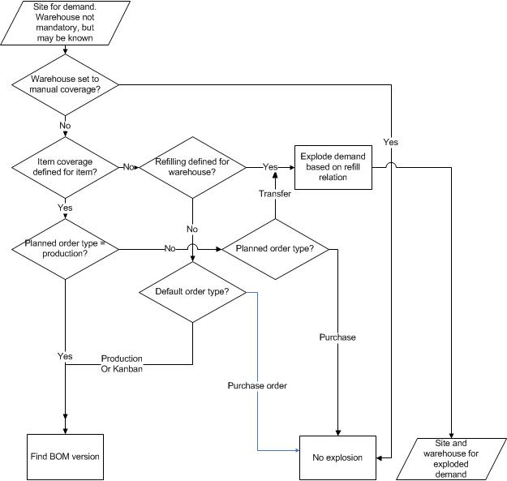

---
# required metadata

title: Master planning for site and warehouse coverage, warehouse not mandatory
description: This topic describes how an item that has site and warehouse as coverage dimensions is planned. The warehouse dimension is not mandatory.
author: YuyuScheller
manager: AnnBe
ms.date: 2017-04-04
ms.topic: article
ms.prod: 
ms.service: Dynamics365Operations
ms.technology: 

# optional metadata

ms.search.form: EcoResStorageDimensionGroup, ReqItemTable
# ROBOTS: 
audience: Application User
# ms.devlang: 
ms.reviewer: YuyuScheller
ms.search.scope: AX 7.0.0, Operations, Core
# ms.tgt_pltfrm: 
ms.custom: 2514
ms.assetid: 92d47bdd-df68-4f60-ac9a-96aa08236c26
ms.search.region: Global
ms.search.industry: Manufacturing
ms.author: roxanad
ms.search.validFrom: 2016-02-28
ms.dyn365.ops.version: AX 7.0.0

---

# Master planning for site and warehouse coverage, warehouse not mandatory

This topic describes how an item that has site and warehouse as coverage dimensions is planned. The warehouse dimension is not mandatory.

This master planning scenario involves the following conditions:

-   The site dimension is set to mandatory and must be entered on the demand transaction. This setting can't be modified.
-   The warehouse dimension is not set to mandatory. The warehouse may be known, but it is not used in the master planning calculation.
-   The site and warehouse dimensions are set for coverage planning. Other dimensions may be set for coverage planning also. However, they are not affected by the multisite functionality.

The following graphic illustrates how master planning proceeds. The parameters that are referred to in the graphic, and their locations, are as follows:
-   The warehouse is set to Manual. Click **Inventory management &gt; Setup &gt; Inventory breakdown &gt; Warehouses**. On the **Master planning** FastTab, see the **Manual** field.
-   Item coverage is defined for the item. Click **Product information management &gt; Products&gt; Released products**. Select the item, and then, on the Action pane, on the **Plan** tab, click **Item coverage**.
-   Refill relations are defined for the warehouse. Click **Inventory management &gt; Setup &gt; Inventory breakdown &gt; Warehouses**. On the **Master planning** FastTab, see the **Main warehouse** field group.
-   The default order type is set to Production, Purchase order, or Kanban. Click **Product information management &gt; Products&gt; Released products**. Select the item, and then, on the Action pane, on the **Plan** tab, click **Default order settings**. In the **Default order settings** form, see the **Default order type**.

 
-

See also
--------

[Master planning and multisite functionality](master-plan-multisite-functionality.md)

[Master planning - site and warehouse coverage, warehouse mandatory](master-plan-site-warehouse-coverage-warehouse-mandatory.md)

[Master planning - site coverage, warehouse mandatory](master-plan-site-coverage-warehouse-mandatory.md)

[Master planning - site coverage, warehouse not mandatory](master-plan-site-coverage-warehouse-not-mandatory.md)

[Master planning - How the BOM version is determined](master-plan-bom-version-determined.md)

