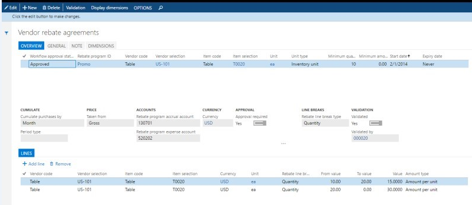

---
# required metadata

title: Vendor rebates examples
description: Vendor rebates help companies better manage their supplier rebate programs by automating tasks that are involved in administering, 
tracking, and claiming rebates that are earned.
author: [author's GitHub alias]
manager: AnnBe
ms.date: 06/20/2017
ms.topic: article
ms.prod: 
ms.service: dynamics-ax-applications
ms.technology: 

# optional metadata

# ms.search.form:  [Operations AOT form name to tie this topic to]
audience: [Pick one: Application User/Developer/IT Pro]
# ms.devlang: 
# ms.reviewer: [Content Strategist microsoft alias]
ms.search.scope: [Which Operations client to show this topic as help for, to be set by content strategist, see list here: https://microsoft.sharepoint.com/teams/DynDoc/_layouts/15/WopiFrame.aspx?sourcedoc={23419e1c-eb64-42e9-aa9b-79875b428718}&action=edit&wd=target%28Core%20Dynamics%20AX%20CP%20requirements%2Eone%7C4CC185C0%2DEFAA%2D42CD%2D94B9%2D8F2A45E7F61A%2FVersions%20list%20for%20docs%20topics%7CC14BE630%2D5151%2D49D6%2D8305%2D554B5084593C%2F%29]
# ms.tgt_pltfrm: 
# ms.custom: [used by loc for topics migrated from the wiki]
ms.search.region: [Global for most topics. Set Country/Region name for localizations]
# ms.search.industry: [leave blank for most, retail, public sector]
ms.author: [author's Microsoft alias]
ms.search.validFrom: [month/year of release that feature was introduced in, in format yyyy-mm-dd]
ms.dyn365.ops.version: [name of release that feature was introduced in, see list here: https://microsoft.sharepoint.com/teams/DynDoc/_layouts/15/WopiFrame.aspx?sourcedoc={23419e1c-eb64-42e9-aa9b-79875b428718}&action=edit&wd=target%28Core%20Dynamics%20AX%20CP%20requirements%2Eone%7C4CC185C0%2DEFAA%2D42CD%2D94B9%2D8F2A45E7F61A%2FVersions%20list%20for%20docs%20topics%7CC14BE630%2D5151%2D49D6%2D8305%2D554B5084593C%2F%29]
---

# Vendor rebates
[!include[banner](../includes/banner.md)]

Vendor rebates help companies better manage their supplier rebate programs by automating tasks that are involved in administering, 
tracking, and claiming rebates that are earned.

This article provides a broad overview of  the most common tasks that you’d want to accomplish when working with vendor rebates. The overview includes the following tasks:

● Review details of a rebate agreement

●	Identify orders that qualify for rebates and generate rebate claims

●	Review and approve claims

## Review details of a vendor rebate agreement
A vendor rebate agreement is a record of a contract with a vendor that specifies the negotiated terms and conditions under which the company qualifies for a monetary reward in return for achieving preset purchase targets. Vendor rebate agreements are recorded on the Rebate agreements page.

To open the **Rebate agreements** page, click **Procurement and sourcing** \> **Vendor rebates** \> **Rebate agreements**.

On the **Rebate agreements** page, you can view details about the negotiated conditions of a vendor agreement:

-   The **Cumulate purchase by** field, **Invoice** indicates that a rebate claim will be determined every time that a purchase order line is invoiced. The calculation of the rebate claim amount can also be set to depend on a period (of week, month, year, lifetime or a customized period).

-   The **Rebate program accrual account** and **Rebate program expense account** fields specify account numbers that will receive accrued rebate amounts during the intermediate stage between approval and processing.

-   In the **Rebate line break type** field, the options **Quantity** and **Amount** indicate that the rebates are either volume-based or amount-based.

-   On the agreement’s **Lines** FastTab, you can see how different quantity tiers can be set up to grant different rebates. For example, in the illustration, the **From value** and the **To value** fields indicate that a product quantity between 10 and 19 units will qualify for a rebate of USD 15 per unit.

In the **Workflow approval status** field, the value **Approved** indicates that the agreement can be applied to purchase orders that meet the agreement’s conditions.

### Example – Purchase products that qualify for a rebate and generate a rebate claim

The vendor rebate agreement that authorizes Contoso to receive a rebate From vendor US-101, Fabrikam Electronics, when it buys item T0020, TelevisionD30042", in any quantity above 10 units, is in place. A purchasing agent now places an order with the vendor.

1.  Click **Procurement and sourcing** \> **Purchase orders** \> **All purchase orders**.
2.  On the **All purchase orders** list page, on the Action Pane, click     **+New**.
3.  In the **Vendor account** field, select **US-101**, and then click **OK**.
4.  On the **Purchase order** page, enter an order line for item **T0020** and a quantity of **30**.
5.  In the **Warehouse** field, enter **13**.
6.  Select the order line, and then click **Purchase order line** \> **View** \> **Price details**.
7.  On the **Price details** page, click the **Rebates** FastTab.

On the **Price details** page, the purchasing agent can see that a rebate from the valid vendor rebate agreement for the total amount of USD 900 is applied to the line. The USD 900 is calculated as the line quantity of 30 units multiplied by USD 30, which is the rebate amount per product unit that applies when the line quantity is more than 30 units (the second quantity break on the agreement). This amount is also shown in the **Vendor rebate** field in the **Margin estimation** section of the **Price details** page.

1.  Close the **Price details** page.
2.  On the **Purchase order** page, on the Action Pane, on the **Purchase** tab, in the **Actions** group, click **Confirm**. You can now invoice the order.
3.  On the Action Pane, on the **Invoice** tab, in the **Generate** group, click **Invoice**.
4.  On the **Vendor invoice** page, in the **Default from** field, select **Ordered quantity**, and then click **OK**.
5.  In the **Number** field, enter **fab-12345** as the invoice identifier. 
6.  On the Action Pane, click **Post**.
7.  The purchase invoice has now been posted, and the rebate claim has been generated for the invoice line.
8.  Click **Procurement and sourcing** \> **Vendor Rebates**\> **Rebate claims**.

The next steps are to review, approve, and process the claim into the
receivable.

### Example – Process the claim and pass it as receivable to A/P

The vendor agreement owner is responsible for periodically reviewing and, as required by the company’s policy, approving the rebate claims that are generated. After claims are approved, the A/P administrator passes them as credit notes to the regular receivables processing.

1. Open the rebate claim.

The rebate balance amount for this claim is USD 900 (30 units multiplied by the rebate amount of USD 30).

> [!NOTE] 
> When a claim is generated, its status is **Calculated**. This status is used because the rebate is granted per invoice, not on a cumulative basis.

2. Close the rebate claim.
3. Mark the claim, and then, on the Action Pane, click **Approve**.
4. On the request page, in the **Vendor** field, select **US-101**, and then click **OK**.

Message bars inform the user that a Rebate accrual journal has been posted for the claim amount. This posting has debited the Accrued Vendor Rebates Receivable account for the expected vendor credit and credited the interim Accrued Vendor Rebates Received account for the expected gain.

5. In the rebate list, select the line, and then, on the Action Pane, click **Rebate transactions** to see and navigate to the journal batch number for this rebate accrual posting. 

The A/P clerk must now complete the rebate claim handling by running the Process function.

6. On the Action Pane, click **Process**, click **Filter**,  in the **Criteria** field for the **Vendor account** field, select **US-101**, and then click **OK**.

The message bars and the status has changed to **Completed** indicate that the following events have occurred:

● A Rebate accrual journal posting has reversed the previous interim amounts on the accrual receivable and expense accounts.

● A vendor invoice (credit note) for the rebate amount has been created and posted.

> [!NOTE] 
> The setting of the **Manual invoice posting** option on the **Rebate program** tab of the **Procurement and sourcing parameters** page determines whether a vendor invoice is posted automatically as part of claim processing or manually.

● As a result, the vendor’s Payable account has been debited, and the Discounts and Allowances Received account has been credited.

> [!NOTE] 
> The Discounts and Allowances Received account number is specified for the procurement category that is used on the purchase invoice line for the rebate. The procurement category, in turn, is set on the **Rebate program** tab of the **Procurement and sourcing parameters** page.

7. In the rebate list, select the line, and then, on the Action Pane, click **Rebate transactions** to see and navigate to the journal batch number for this rebate accrual posting and also the vendor invoice number.
8. Select the line for the vendor invoice transaction, and then, on the Action Pane, click **Vendor invoice**.

The Invoice journal shows details for the invoice. The line specifies the details of the vendor invoice for the **Commissions and Rebates** procurement category, a quantity **–1**, and an amount of **–900**. 

9. On the **All vendors** page, select vendor **US-101**, and then, on the Action Pane, click **Transactions** and find the line for the invoice. The positive amount of USD 900 has now been added to the vendor balance.

The process for handling vendor rebates involves multiple manual tracking tasks that are often tedious. By automating these tasks, vendor rebate management helps with the following processes:

 - Generating accurate rebate claims
 - Accruing the expected receivable and interim gain in the general ledger
 - Updating the vendor balance and the income statement with the allowance that is due

### Prerequisites

The following examples use the USMF demo company. The following parameters are set on the **Procurement and sourcing parameters** page:

● On the **Prices** tab, the **Enable price details** option is set to **Yes**.

● On the **Margin alerts** tab, the **Enable margin alert** option is set to **Yes**.
