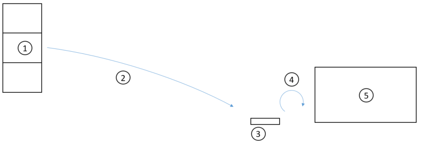

---
# required metadata

title: Reporting material consumption with the mobile device | Microsoft Docs
description: This topic describes a workflow that enables registration of raw material consumption in production by using a handheld device.
author: johanhoffmann
manager: AnnBe
ms.date: 0000-00-00 00:00:00
ms.topic: article
ms.prod: 
ms.service: dynamics-ax-applications
ms.technology: 

# optional metadata

# ms.search.form:  
# ROBOTS: 
# audience: 
# ms.devlang: 
ms.reviewer: bis
# ms.search.scope: AX 7.0.0, Operations
# ms.tgt_pltfrm: 
ms.custom: 1706093
ms.assetid: 75ee68e0-4b9f-4f4d-b286-f498e0eb73fa
ms.search.region: Global
# ms.industry: 
ms.author: johanho
ms.search.validFrom: 2016-02-28
ms.dyn365.ops.version: AX 7.0.0
---

# Reporting material consumption with the mobile device

This topic describes a workflow that enables registration of raw material consumption in production by using a handheld device.

Introduction
------------

This workflow is relevant if there is a strict requirement for material traceability. In those cases, to maintain traceability of the materials, the exact time and quantity must be reported for the consumption. This process can be seen as opposed to pre- or back-flushing operations, where there is an offset between the time of registration and the time when the actual consumption takes place. This explains why a strategy of automatic consumption cannot be used for some materials with traceability requirements. Let’s look at a simple scenario that explains how to set up a workflow to enable registration of raw material consumption in production by using a handheld device. 

### Scenario details

A continuous production process (5) consumes the batch-controlled raw material RM-100. The material is on-hand on location Bulk-001 (1) on license plate PL-1 with two batches, B1 and B2, both with a quantity of 100 lbs. Warehouse work (2) is released and processed for RM-100, and the material is picked from Bulk-001 to the production input location PIL-01 (3), which is defined as non-license plate controlled. The machine operator weighs out material from the production input location (3) and registers the weight and batch number as consumed (4). From the production input location, a portion of the material is manually added to the production process in defined time intervals. When the machine operator adds material, it is weighed on a scale and the batch number is registered.

## Set up the workflow to register consumption using a handheld device
Create a finished-good product, FG-100, with a bill of material that has the batch-controlled raw material RM-100. Add two batches, B1 and B2, of RM-100 in a quantity of 100 to location: Bulk-001 on license plate: PL-1. The flushing principle on the bill of material line for RM-100 is set to **Manual**. Set  the production input location to PIL-01. You can do that by selecting this location as the default production input location on warehouse 51.

1.  Create a new mobile device menu item: 

-    **Menu item name** - Register material consumption. 
-    **Title** - Register material consumption. 
-    **Mode** - Indirect. 
-    **Activity code** - Register material consumption.

2.  Add the menu item to the **Production Mobile** device menu.
3.  Create a production order for the finished product: 

-    **Item number** - FG-100 
-    **Site** - 5 
-    **Warehouse** - 51 
-    **Quantity** - 150

The production order is **Estimated** and **Released** and warehouse work is created.

4.  Complete the work using the workflow for raw material picking for the handheld device.

This will bring the material from the bulk location to the production input location PIL-01. After the work is completed, the material has the status **Picked on the production input location**. The status after work has been processed can be either **Picked** or **Reserved physical**. This is configured with the parameter **Issue status after put on the warehouse form**.

5.  Start the production order either from the client or from the handheld device by using the **Production start** menu item.

After the production order has been started, you can register material consumption with the workflow for the handheld device. Let's start by registering consumption of 25 lbs of batch B1.

6.  Select the **Register material** **consumption** menu item in the menu for the hand held device, enter the following details: 

-    The production order number. 
-    The location on which the material is going to be consumed, in this case PIL-01. 
-    Item number RM-100. 
-    Batch number B1. 
-    A quantity of 25.

7.  Select **OK**.

Note that the message "Journal line is created" appears on the display. On the production order there is an open journal of the type **Production picking list** for item number RM-100 and batch number B1. 

You can now choose to continue your registration, for example on batch number B2, and each time you select **OK,** a new journal line is added to the open journal. 

After you have finished your registration, select **Done** to post the journal and end the workflow.

### Additional comments 

-   If a user cancels the workflow after a journal line is created, the journal is in an unposted state but if the user at a later point uses the workflow for the same production order, then the lines will be added to the open journal rather than to a new journal.
-   The new workflow also supports the registration of serial numbers.
-   It is only possible to register an item number that is defined in the bill of material or in the formula for the selected production order or batch order.
-   Material can be overconsumed. For example, if the material is estimated to be consumed with the quantity of 100 lbs, then it can be overconsumed with a quantity of, for example, 105 lbs.

