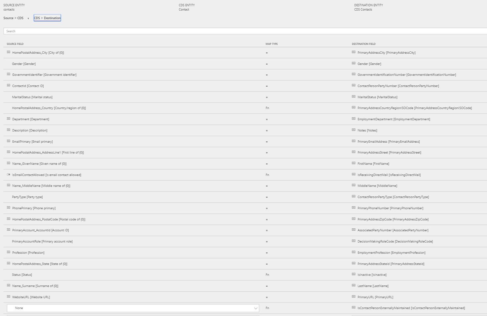
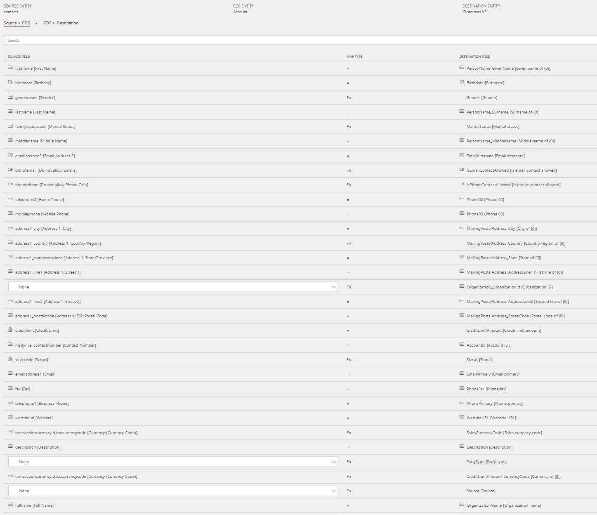

---
# required metadata

title: Contact (Contacts) and Contact (Customers)
description: This topic discusses the templates and underlying tasks that are used to synchronize Contact (Contacts) and Contact (Customers) from Microsoft Dynamics 365 for Sales to Microsoft Dynamics 365 for Finance and Operations, Enterprise edition.
author: ChristianRytt
manager: AnnBe
ms.date: 07/3/2017
ms.topic: article
ms.prod: 
ms.service: dynamics-ax-applications
ms.technology: 

# optional metadata

ms.search.form: 
# ROBOTS: 
audience: Application User, IT Pro
# ms.devlang: 
ms.reviewer: YuyuScheller
ms.search.scope: Core, Operations, UnifiedOperations
# ms.tgt_pltfrm: 
ms.custom: 
ms.assetid: 
ms.search.region: global
ms.search.industry: 
ms.author: ChristianRytt
ms.dyn365.ops.intro: July 2017 update 
ms.search.validFrom: 2017-07-8

---

# Contact (Contacts) and Contact (Customers)

[!include[banner](../includes/banner.md)]

This topic discusses the templates and underlying tasks that are used to synchronize Contact (Contacts) and Contact (Customers) from Microsoft Dynamics 365 for Sales to Microsoft Dynamics 365 for Finance and Operations, Enterprise edition.

Contact (Contacts) and Contact (Customers)

The following templates and underlying tasks are used to synchronize products from Microsoft Dynamics 365 for Sales (Sales) to Microsoft Dynamics 365 for Finance and Operations, Enterprise edition.

Name of template:

-   Contacts to Contact (Sales to Fin and Ops)

-   Contacts to Customer (Sales to Fin and Ops)

Name of task in project:

-   Contacts

-   ContactToCustomer

Sync tasks required prior to Contact sync: Accounts (Sales to Fin and Ops)

## Entity sets

| **Sales** | **CDS** | **Finance and Operations** |
|-----------|---------|----------------------------|
| Contacts  | Contact | CDS Contacts               |
| Contacts  | Account | Customers V2               |

## Entity flow

**Contacts** are managed in Sales and synchronized to CDS and Finance and Operations.

A **Contact** in Sales can become either a **Contact** in CDS and Finance and Operations, or it can become an **Account** in CDS and **Customer** in Finance and Operations. When determining whether a given contact should be picked up in Sales for synchronization to CDS and Finance and Operations, for example, **Contacts** (Sales) -\> **Contact** (CDS) -\> **Contacts** (Finance and Operations) synchronization, the system looks at the following properties on **Contact** in Sales:

Sync to **Account** in CDS and **Customer** in Finance and Operations:

**Contacts** with **Is Active Customer = Yes**

Sync to **Contact** in CDS and **Contact** in Finance and Operations:

**Contacts** with **Is Active Customer = No** and **Company** (Parent Account/Contact) pointing to an **Account** (not a Contact)

## Prospect to cash solution for Sales 

A new field **Is Active Customer** is added to the **Contact**. The purpose of this field is to differentiate between contacts with and without sales activity. Only contacts with related quotes, orders, or invoices have **Is Active Customer = Yes** and synced to Finance and Operations as **Customers**.

A new field **IsCompanyAnAccount** is added to the **Contact**. The purpose of this field is to identify contacts linked to a **Company (Parent Account/Contact)** of type **Account**. This information is used to identify **Contacts** who should be synced to Finance and Operations as **Contacts**.

 A new field **Contact Number** field is added to the **Contact** entity to ensure a natural and unique key for the integration. When creating a new contact, the **Contact Number** is automatically generated using a number sequence starting with CON followed by an increasing number sequence and ending with a suffix of 6 characters. For example, CON-01000-BVRCPS.

When the integration solution for Sales is added to Sales, an upgrade script populates **Contact numbers** to existing **Contacts** using the number sequence discussed in the previous section. The upgrade script also populates the **Is Active Customer** field for contacts with any sales activity set to **Yes**. 

## In Finance and Operations 

Contacts are tagged with the property I**sContactPersonExternallyMaintained** to indicate that the given contact is maintained externally, in this case from Sales.

## Preconditions and mapping setup

###  Contact to Contact

-   Update the **CDS Organization ID in Source -\> CDS**

    -   Template value for **Organization_OrganizationId [Organization ID]** is defaulted to ORG001.

    -   Template value for **PrimaryAccount_Organization_OrganizationId [Organization ID]** is defaulted to ORG001.

-   **Address Country region code** is required in Finance and Operations. To avoid sync errors, you can default a value in the **CDS -\> Operations mapping** that is used if the field is left blank in Sales.

    -   Template value for **PrimaryAddressCountryRegionISOCode** is defaulted to USA.

-   Ensure that the following value exist in Finance and Operations. If the information is not desired in Finance and Operations, the mapping can be remove from **CDS -\> Destination** mapping.

    -   Field name in Finance and Operations: **Decision**

        -   Mapping: PrimaryAccountRole = DecisionMakingRole

### Contact to Customer

-   Update the **CDS Organization ID in Source -\> CDS**

    -   Template value for **Organization_OrganizationId [Organization ID]** is defaulted to ORG001.

-   **Address Country region code** is required in Finance and Operations. To avoid sync errors, you can default a value in the **CDS -\> Operations
    mapping** that is used if the field is left blank in Sales.

    -   Template value for **PrimaryAddressCountryRegionISOCode** is defaulted to USA.

-   **CustomerGroup** is required in Finance and Operations. To avoid sync errors, you can default a value in the **CDS -\> Operations mapping** that is used if the field is left blank in Sales.

    -   Template value for **CustomerGroupId** is defaulted to 10.

-   It is possible to add the following mappings from **CDS -\> Destination** to reduce the manual updates needed in Finance and Operations. This can be done with a default or a **ValueMap** from for example, **Country/Region** or **City**.

    -   **SiteId** - Site can also be defaulted on Products in Finance and Operations. Site is required to generate Quote and Sales order in Finance and Operations.

        -   Template value for **SiteId** is not defined.

    -   **WarehouseId** - Warehouse can also be defaulted on the Products in Finance and Operations. Warehouse is required to generate Quote and Sales order in Finance and Operations.

        -   Template value for **WarehouseId** is not defined.

    -   **LanguageId** - Language is required to generate Quote and Sales order in Finance and Operations.

        -   Template value for **LanguageId** is defaulted to en-us. 

## Template mapping in data integrator

### Contact to Contact

The following screenshots show how the template mapping can look like in data integrator.

### Contact to Customer

