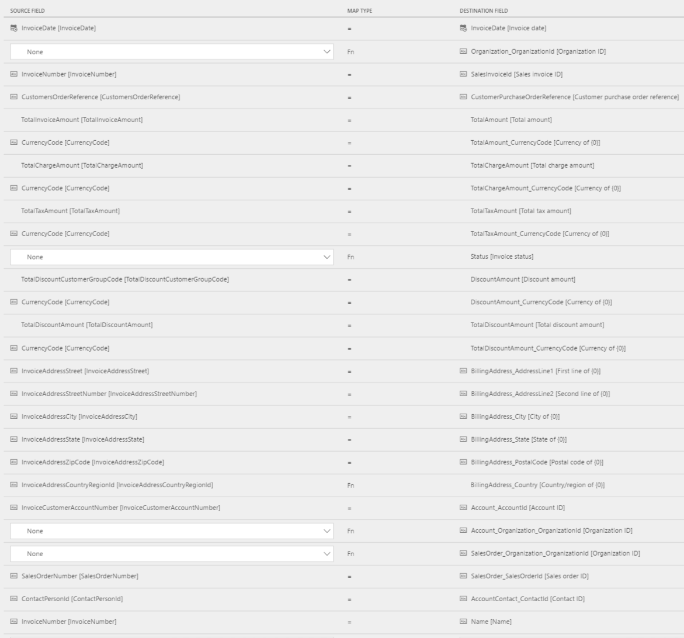
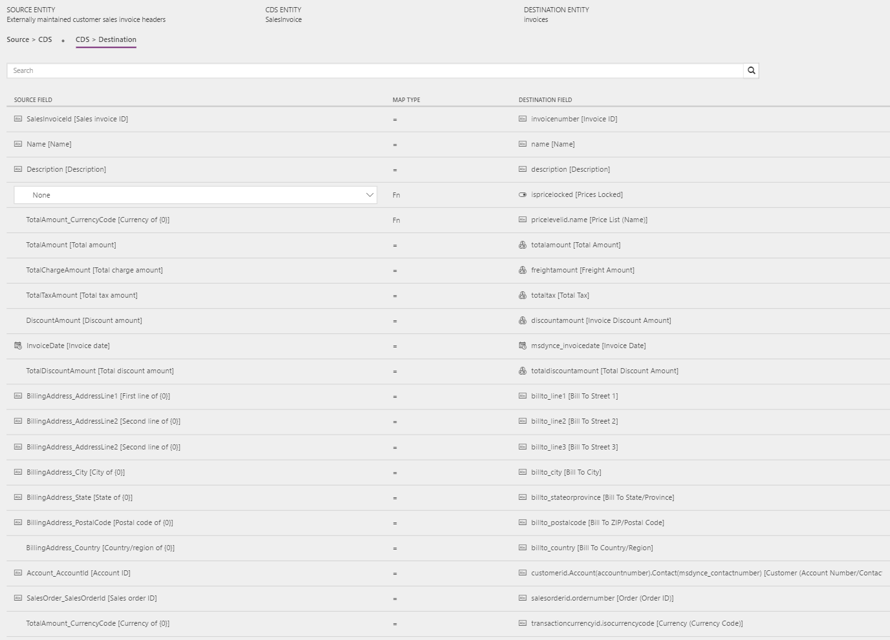
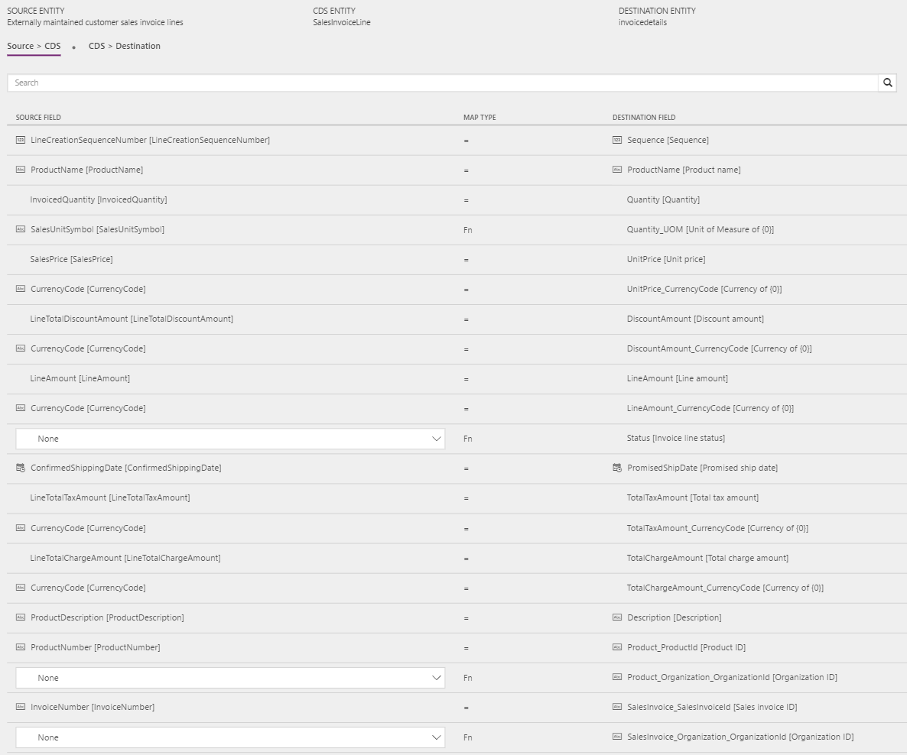
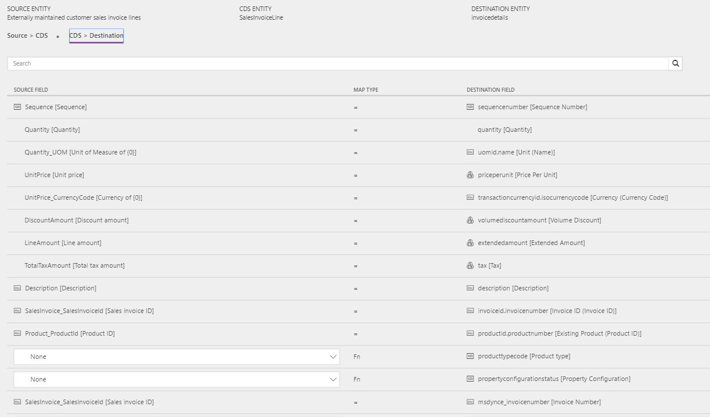

---
# required metadata

title: Sales invoice headers and lines
description: The topic discusses the templates and underlying tasks that are used to synchronize sales invoice headers and lines from Microsoft Dynamics 365 for Finance and Operations, Enterprise edition, to Microsoft Dynamics 365 for Sales. 
author: ChristianRytt
manager: AnnBe
ms.date: 07/3/2017
ms.topic: article
ms.prod: 
ms.service: dynamics-ax-applications
ms.technology: 

# optional metadata

ms.search.form: 
# ROBOTS: 
audience: Application User, IT Pro
# ms.devlang: 
ms.reviewer: YuyuScheller
ms.search.scope: Core, Operations, UnifiedOperations
# ms.tgt_pltfrm: 
ms.custom: 
ms.assetid: 
ms.search.region: global
ms.search.industry: 
ms.author: ChristianRytt
ms.dyn365.ops.intro: July 2017 update 
ms.search.validFrom: 2017-07-8

---

# Sales invoice headers and lines

[!include[banner](../includes/banner.md)]

The topic discusses the templates and underlying tasks that are used to synchronize sales invoice headers and lines from Microsoft Dynamics 365 for Finance and Operations, Enterprise edition, to Microsoft Dynamics 365 for Sales. 

## Template and Task

The following templates and underlying tasks are used to synchronize sales invoice headers and lines from Finance and Operations to Sales:

- **Name of the template:** Sales Invoices (Fin and Ops to Sales)
- **Names of the tasks in the project:**

    - SalesInvoiceHeader
    - SalesInvoiceLine

The following synchronization tasks are required before synchronization of sales invoice headers and lines can occur:

- Products
- Accounts (if used)
- Contacts (if used)
- Sales order header and lines

## Entity set

| Finance and Operations                               | CDS              | Sales          |
|------------------------------------------------------|------------------|----------------|
| Externally maintained customer sales invoice headers | SalesInvoice     | Invoices       |
| Externally maintained customer sales invoice lines   | SalesInvoiceLine | InvoiceDetails |

## Entity flow

Sales invoices are created in Finance and Operations and synchronized to Sales.

## Prospect to cash solution for Sales

An **Invoice Number** field has been added to the Invoice entity and appears on the page.

The **Create Invoice** button on the **Sales order** page is hidden, because invoices will be created in Finance and Operations and synchronized to Sales. The invoice page can't be edited, because invoices will be synchronized from Finance and Operations.

The **Sales order status** is automatically set to **Invoiced** when the related invoice from Finance and Operations has been synchronized to Sales. Additionally, the owner of the sales order that the invoice was created from is assigned as the owner of the invoice. Therefore, the owner of the sales order can view the invoice.

## Preconditions and mapping setup

Before you synchronize invoices, in Sales, go to **Settings** &gt; **Administration** &gt; **System settings** &gt; **Sales**, and make sure that **Use system prizing calculation system** is set to **No**. This setting helps guarantee that the item price from the invoice in Finance and Operations is used when the invoice is generated in Sales.

###  InvoiceHeader

- Update the mapping for **CDS Organization ID** in **Source &gt; CDS**:

    - The default template value for **SalesOrder_Organization_OrganizationId** is **ORG001**.
    - The default template value for **Account_Organization_OrganizationId** is **ORG001**.
    - The default template value for **Organization_OrganizationId** is **ORG001**.

- Make sure that the required mapping for **InvoiceCountryRegionId** to **BillingAddress_Country** exists in **Source &gt; CDS**. The default template value is a value map where several countries are mapped.
- **Price list** is required in order to create invoices in Sales. In the **CDS &gt; Destination** mapping, update the value map for **pricelevelid.name [Price List Name]** to the price list that is used per currency in Sales. You can specify a singe default price list. Alternatively, if you have price lists in multiple currencies, you can use a value map. Here is an example of a value map that is used for the template value: **usd : CRM Service USA (sample)**.

### InvoiceLine

- Make sure that the required mapping for **Unit of measure** exists in **Source &gt; CDS**.
- Make sure that the required value map for **SalesUnitSymbol** in Finance and Operations exists in **Source &gt; CDS**. A template value that uses a value map is defined for **SalesUnitSymbol to Quantity_UOM**.
- Update the mapping for **CDS Organization ID** in **Source &gt; CDS**:

    - The default template value for **SalesInvoicer_Organization_OrganizationId** is **ORG001**.
    - The default template value for **Product_Organization_OrganizationId** is **ORG001**.

## Template mapping in data integrator

> [!NOTE]
> The **Payment terms**, **Freight terms**, **Delivery terms**, **Shipping method**, and **Delivery mode** fields aren't part of the default mappings. To map these fields, you must set up a value mapping that is specific to the data in the organizations that the entity is synchronized between.

The following illustrations show an example of a template mapping in data integrator.

