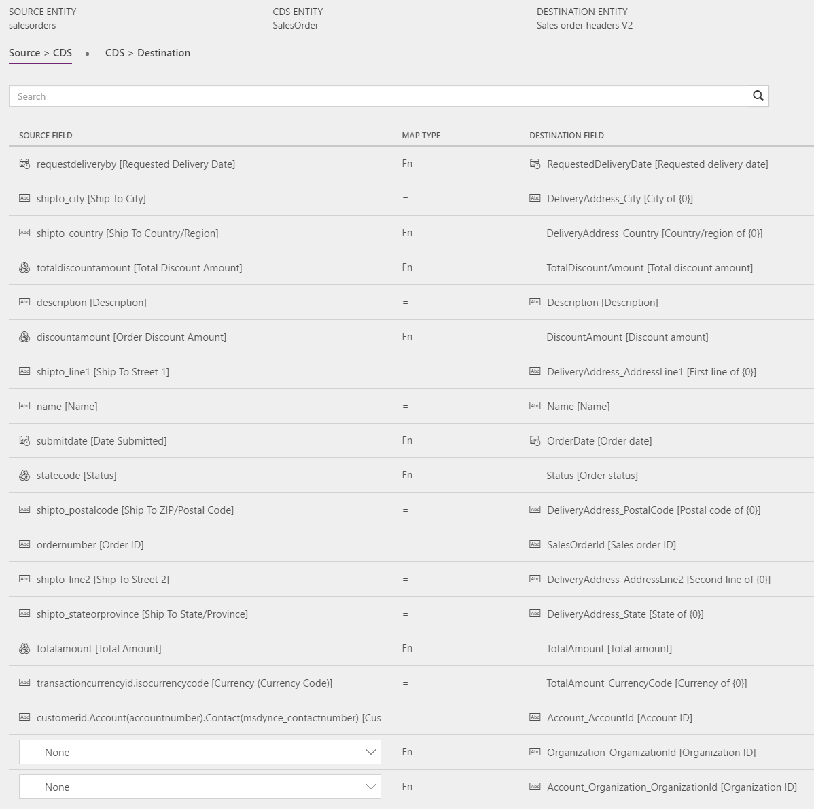
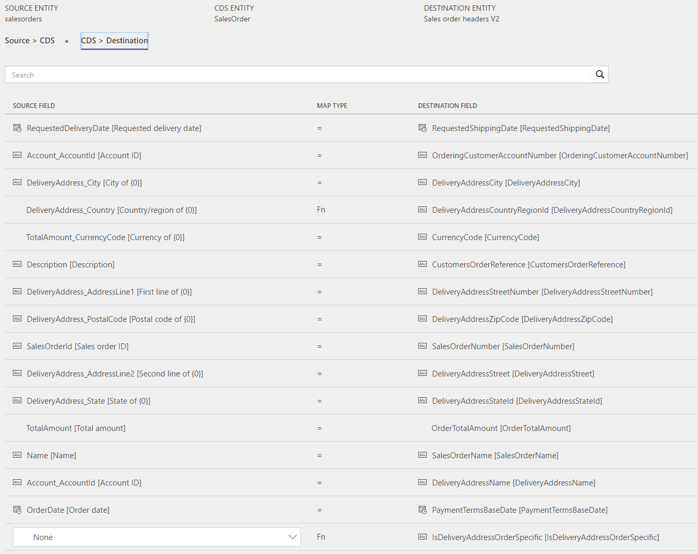
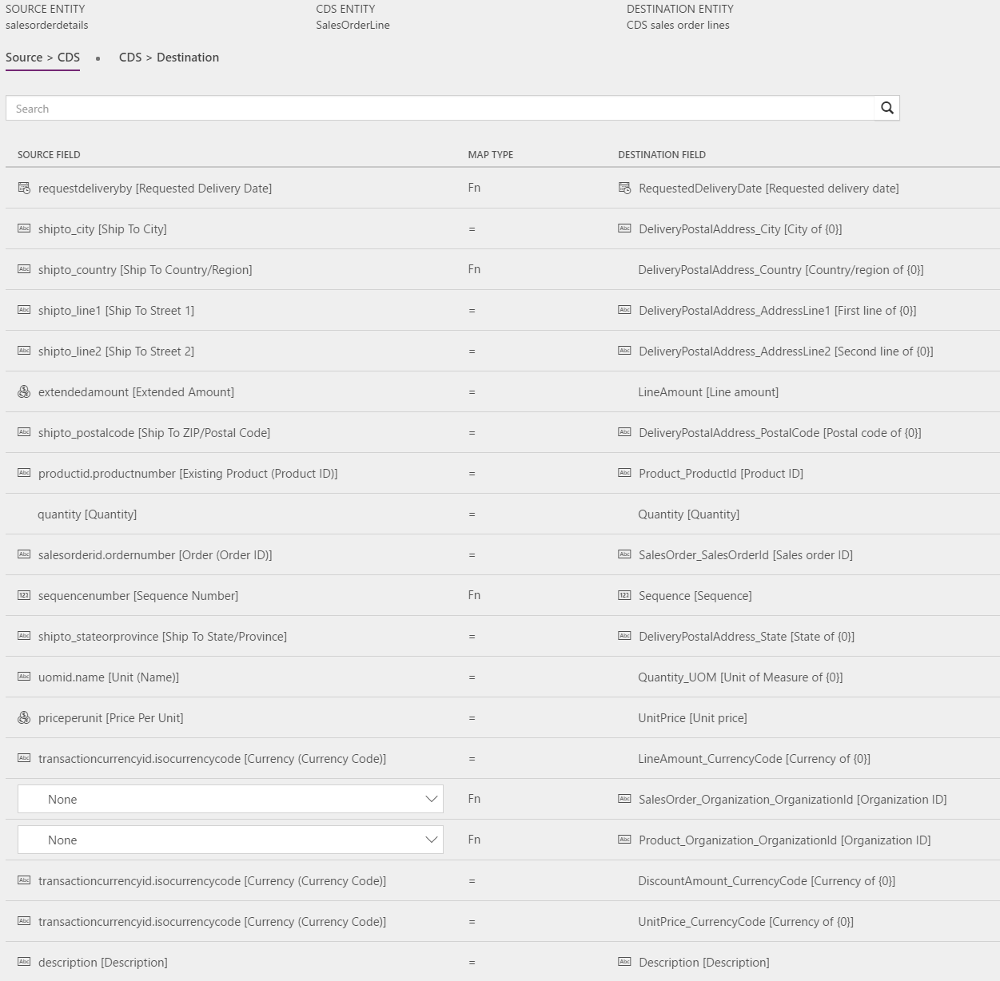
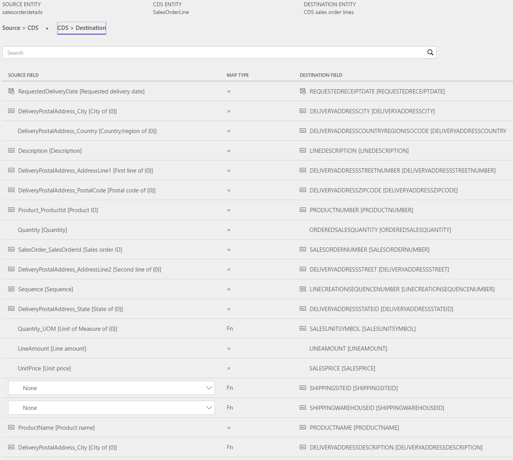

---
# required metadata

title: Sales order headers and lines
description: The topic discusses the templates and underlying tasks that are used to synchronize sales order headers and lines from Microsoft Dynamics 365 for Sales to Microsoft Dynamics 365 for Finance and Operations, Enterprise edition. 
author: ChristianRytt
manager: AnnBe
ms.date: 07/3/2017
ms.topic: article
ms.prod: 
ms.service: dynamics-ax-applications
ms.technology: 

# optional metadata

ms.search.form: 
# ROBOTS: 
audience: Application User, IT Pro
# ms.devlang: 
ms.reviewer: YuyuScheller
ms.search.scope: Core, Operations, UnifiedOperations
# ms.tgt_pltfrm: 
ms.custom: 
ms.assetid: 
ms.search.region: global
ms.search.industry: 
ms.author: ChristianRytt
ms.dyn365.ops.intro: July 2017 update 
ms.search.validFrom: 2017-07-8

---

# Sales quotation headers and lines

[!include[banner](../includes/banner.md)]

The topic discusses the templates and underlying tasks that are used to synchronize sales order headers and lines from Microsoft Dynamics 365 for Sales to Microsoft Dynamics 365 for Finance and Operations, Enterprise edition. 

## Template and Task

The following templates and underlying tasks are used to synchronize sales order headers and lines from Microsoft Dynamics 365 for Sales (Sales) to Microsoft Dynamics 365 for Finance and Operations, Enterprise edition (Finance and Operations).

Name of template: Sales Orders (Sales to Fin and Ops)

Name of task in project:

-   OrderHeader

-   OrderLine

 

Sync tasks required prior to Sales order header and lines sync:

-   Products

-   Accounts (if used)

-   Contacts (if used)

## Entity set

| **Sales**         | **CDS**        | **Operations**          |
|-------------------|----------------|-------------------------|
| SalesOrders       | SalesOrder     | Sales order headers V2  |
| SalesOrderDetails | SalesOrderLine | CDS sales order lines   |

## Entity flow

**Sales orders** are created in Sales and synchronized to Finance and Operations. **Sales orders** from Sales will only be synchronized under the following conditions:

1.  All products on the sales order lines are externally maintained.

2.  The sales order has been submitted.

## Prospect to cash solution for Sales
-----------------------------------

The field **Has Externally Maintained Products Only** is added to the **Order header** to consistently keep track of whether the sales order is made up entirely of **Externally Maintained Products**, in which case Products are maintained in Finance and Operations. This is done to ensure that you don't try to sync sales order lines with Products that are unknown to Finance and Operations.

All **Order Products/lines** are updated with the **Externally Maintained** information from the **Sales order header** and this information can be found in the field **Order Has Externally Maintained Products Only** on the **Order line** entity.

Orders with **Has Externally Maintained Products Only = Yes** can be submitted by clicking the **Submit Order** button. Only **Submitted Orders** and **Order products/lines** will sync to CDS and Finance and Operations.

The **Order status** changes automatically to **Invoiced** once the related invoice from Finance and Operations has synchronized to Sales. Also, the **Owner** of the sales order from which the invoice was created from is assigned as the **Owner** of the invoice. This gives the **Owner** of the sales order the ability to view the invoice.

**Discount**, **Charges** and **Tax** are controlled by a complex setup in Finance and Operations, which does not allow for integration mapping at this point. The current design is that **Price**, **Discount**, **Charge** and **Tax** are mastered and handled by Finance and Operations.

In Sales, the solution makes the following fields read-only because these values do not sync to Finance and Operations.

-   Read-only on SO Header: Discount %, Discount, Freight Amount

-   Read-only on SO Line: Tax

## Preconditions and mapping setup

-   Before synchronizing sales orders, it is important to update Sales with the
    following setting:

     -   Under **Settings \> Administration \> System settings \> Sales** ensure that **Discount calculation method** is set to Per unit. This is done to ensure that the line item discount from Sales match the setting in Finance and Operations. Without this setting the discount would not be correct in Finance and Operations, as Finance and Operations would read the discount as a discount per unit, even if it was per line in Sales.

-   In Finance and Operations, **Number sequence** for **Sales orders** must be set to **Manual**.

    -   **Account receivable \> Setup \> Account receivable parameters \> Number sequence - Number sequence for sales orders. View details**. Under **General Setup**, set **Manual = Yes**.

-   To avoid sync failing for sales orders, **Delivery date control** should be set to **None** as default in Finance and Operations. This is done under **Accounts receivable \> Setup \> Accounts receivable parameters \> Shipments**.

### SalesHeader

-   **Requested delivery date** is required in Finance and Operations and sync will fail if the date is blank. To avoid this issue, the date is defaulted from **Source -\> CDS** in case of blank value. The date should be updated to a preferred value. Currently, it is not possible to enter something like [today] for today's date, so it must be a given date.

    -   Template value for **Requested delivery date** is defaulted to 1/1/2020.

-   **Order date** is required in CDS and sync will fail if the field is blank. To avoid this issue, the date is defaulted from **Source -\> CDS** in case of blank value. The date should be updated to a preferred value. Currently, it is not possible to enter something like [today] for today's date, so it must be a given date.

    -   Template value for Order date is defaulted to 1/1/2020.

-   **Address Country region code** is required in Finance and Operations. To avoid sync errors, you can default a value that is used if the field is left blank in Sales.

    -   Template value for **DeliveryAddressCountryRegionISOCode** is defaulted to USA.

-   Update the mapping for **CDS Organization ID Organization_OrganizationId in Source -\> CDS.**

    -   Template value for **SalesOrder_Organization_OrganizationId** is defaulted to ORG001.

    -   Template value for **Product_Organization_OrganizationId** is defaulted to ORG001.

### SalesLine

-   It is possible to add the following mappings from **CDS -\> Destination** to avoid that sales line fails to import to Finance and Operations if the information is neither defaulted from customer, nor from product:

    -   **SiteId** - Site is required to generate **Quotes** and **Sales orders** in Finance and Operations.

        -   Template value for SiteId is defaulted to 1.

    -   **WarehouseId** - Warehouse is required to process **Quote** and **Sales orders** in Finance and Operations.

        -   Template value for WarehouseId is defaulted to 13.

-   Ensure that the needed **ValueMap** for selling UOM in Finance and Operations exists in the **CDS -\> Destination mapping** for **Quantity_UOM / SALESUNITSYMBOL**.

## Template mapping in data integrator

> [!NOTE]

> **Payment terms**, **Freight terms**, **Delivery terms**, **Shipping method**, and **Delivery mode** are not part of the default mappings. Mapping of these fields requires value mapping to be set up, which is specific to the data in the organizations between which the entity is synchronized.

The following screenshots show how the template mapping can look like in data integrator.

### OrderHeader:

### OrderLine:

