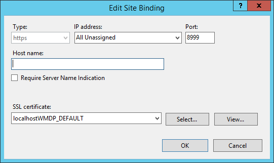
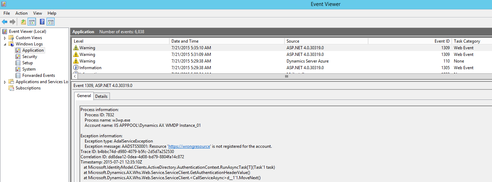

---
# required metadata

title: Warehouse Mobile Devices Portal (WMDP) for Dynamics 365 for Operations
description: This article describes how to enable the Warehouse Mobile Devices Portal for Microsoft Dynamics 365 for Operations. It also explains how to service and upgrade your environment.
author: YuyuScheller
manager: AnnBe
ms.date: 2016-01-28 11 - 57 - 22
ms.topic: article
ms.prod: 
ms.service: Dynamics365Operations
ms.technology: 

# optional metadata

# ms.search.form: 
# ROBOTS: 
audience: Developer
# ms.devlang: 
# ms.reviewer: 2084
ms.search.scope: AX 7.0.0, Operations, Core
# ms.tgt_pltfrm: 
ms.custom: 30171
ms.assetid: acdddf48-d385-4f86-8633-013ff2d6eecd
ms.search.region: Global
# ms.search.industry: 
ms.author: mafoge
ms.search.validFrom: 2016-02-28
ms.dyn365.ops.version: AX 7.0.0

---

# Warehouse Mobile Devices Portal (WMDP) for Dynamics 365 for Operations

This article describes how to enable the Warehouse Mobile Devices Portal for Microsoft Dynamics 365 for Operations. It also explains how to service and upgrade your environment.

Warehouse Mobile Devices Portal (WMDP) is a web application hosted in IIS. It uses ASP.NET MVC runtime. For the current version of Microsoft Dynamics 365 for Operations, WMDP is provided as a standalone component, meant for self-deployment on-premises. In order to enable the WMDP on your environment, you need to download the installer, deploy the WMDP application, and configure it to connect with a Dynamics 365 for Operations server. This article explains how to enable WMDP on your environment. It also explains the process of introducing a hotfix into your environment.

## Download the installer for Warehouse Mobile Devices Portal
The WMDP is installed through a standalone Microsoft installation package. The installer file, WarehouseMobileDevicesPortal.msi, can be downloaded directly from Dynamics 365 for Operations. In order to obtain the installer, you need to have Warehouse Management module enabled. Follow these steps to download the WMDP installer:

1.  Log-in to Dynamics 365 for Operations as a user with an Information technology manager role.
2.  Go to **Warehouse management** &gt; **Setup** &gt; **Mobile device** &gt; **Download Warehouse Mobile Devices Portal**.
3.  Familiarize yourself with the Security Best Practices checklist. Select the **Complete** check box for each item that you’ve reviewed.
4.  In the Legal Information section, read the software license terms.
5.  Click **OK**. The WarehouseMobileDevicesPortal.msi then downloads, as show in the following screenshot. 

## Install the Warehouse Mobile Devices Portal
The Warehouse Mobile Devices Portal installer supports the installation of up to 100 instances on the same Windows server machine. Follow these steps to install an instance of WMDP instance:

1.  To install a default instance, run the WarehouseMobileDevicesPortal.msi. -or- To install a non-default instance, execute following command:

        msiexec /I WarehouseMobileDevicesPortal.msi TRANSFORMS=:<InstanceID> MSINEWINSTANCE=1

    where: **InstanceID** is the named instance identifier. Use values **Instance\_01** to **Instance\_99** to identify the name of the instance to deploy. 

2.  Click **Next**.
3.  Choose an installation location, or leave the default installation location (recommended).
4.  Click **Next**.
5.  On the **IIS configuration** page, in the **Website port** field, enter the TCP port on which the website is meant to be available. For example, type 8999.
6.  Click **Next**.
7.  The setup wizard is now ready to complete installation. 

    

8.  Click **Install**.
9.  When the installation is complete, click **Finish**.

## Retrieve and install a certificate on your Warehouse Mobile Device Portal host machine
The Warehouse Mobile Devices Portal is deployed to run using https. The installer creates https binding on a chosen port, but does not associate any SSL/TLS certificate with it. In order to complete the initial configuration process, you need to associate the certificate with your binding.

-   Deploy a commercial certificate distributed by a well-known certificate authority. By using trusted providers, the certificate will by default be trusted by the client browsers in your warehouse. This is a recommended choice for a commercial deployment.
-   Alternatively, you may consider creating a self-signed certificate. This is a handy practice for development and staging environments. Follow this tutorial to create a Self-Signed Server Certificate: <https://technet.microsoft.com/en-us/library/cc753127(v=ws.10).aspx>

To retrieve and install a certificate on your Warehouse Mobile Device Portal host machine:

1.  In IIS, open the bindings for your Warehouse Mobile Device Portal site, as shown in the following screenshot.
2.  Select your binding. 
3.  Click **Edit** and associate any host names that you will use for the Warehouse Mobile Devices Portal. For more information, refer to <https://technet.microsoft.com/en-us/library/cc771629.aspx>.
4.  The following screenshot shows an example of a self-signed certificate named localhostWMDP\_DEFAULT, associated with https binding on port 8999. 

## Configure the Warehouse Mobile Devices Portal web application
To enable the Warehouse Mobile Devices Portal application to interact with a particular Dynamics 365 for Operations server, you need to complete the following configuration steps after installation:

1.  Register a native application in Azure Active Directory for the Operations tenant. This application should have access to Microsoft Dynamics ERP.
    1.  Read the following guide to learn about Dynamics 365 for Operations custom service authentication: the Custom services section in the [Dynamics 365 for Operations Services Technical Concepts Guide](/dev-itpro/data-entities/services-home-page).
    2.  Follow the steps for “Register a Native Application with AAD”.
    3.  You have now obtained **Client ID** of the application.

2.  Create a new user account in Azure Active Directory for the Operations tenant. The purpose of this user account is to access the WMDP specific custom service, which the Operations server exposes. After completing this step, you will have **WMDP user credentials**, which consist of a **WMDP email address** and a **WMDP password**. To learn about the basic steps for adding users to Azure AD and Dynamics 365 for Operations, refer to this tutorial: [Sign up for a Microsoft Dynamics 365 for Operations subscription](https://ax.help.dynamics.com/wiki/sign-up-for-a-microsoft-dynamics-rainier-preview).
3.  Create an Operations user that corresponds to the **WMDP user credentials**.
    1.  In Dynamics 365 for Operations, go to **System administration** &gt; **Common** &gt; **Users**.
    2.  Create a new user.
    3.  Assign the Warehouse mobile device user, as shown in the example screenshot. 

4.  Update the Warehouse Mobile Devices Portal web.config file.
    1.  In Internet Information Services (IIS) Manager, find your website.
    2.  On the **Actions** pane, select **Explore** in order to browse the WMDP website sources.
    3.  Edit the Web.config file and find **ServiceConnection** element.
    4.  Assign a value to the URI attribute of the **ServiceReference** element:

             <your root Operations URL>/api/services.

        For example:

             URI="https://dynamics1622aos.cloud.dynamics.com/api/services/

    5.  Assign values to following attributes of the **Authentication** element:

            ServiceSecurityResource = <your lower-cased root Operations URL>
            ServiceClientID = <Client ID> (obtained in step 1 of this section)
            ServiceUserName = <WMDP email address> (obtained in step 2 of this section)
            ServiceUserPassword = <WMDP password> (obtained in step 2 of this section)
            ServiceAuthenticationURL = <authentication URL to your tenant>

        For example:

            ServiceSecurityResource = https://usncax1aos.cloud.onebox.dynamics.com
            ServiceClientID = "aaaaaaaa-1234-bbbb-5678-ccccccccccc"
            ServiceUserName = WMDPapp@contoso.net
            ServiceUserPassword = "wmdpP@ss"
            ServiceAuthenticationURL = "https://login.windows.net/contoso.net"

5.  Even though the Web.config file has an exclusive strong ACL applied to it, for security reasons you should make sure that you remove any credentials from the Web.config file before going live. In this step, you will protect the credentials created in the previous step, by saving them in Windows Credentials Manager.

    1.  Open the main page of the Warehouse Mobile Devices Portal.
    2.  Click **Load web application configuration**. 
    3.  After successfully recording your credentials, the following message displays. 
    4.  In the Web.config file, set ServiceUserName and ServiceUserPassword to empty strings:

    <!-- -->

        ServiceUserName = "" 
        ServiceUserPassword = ""

6.  Go back to your browser and click **Load web application configuration** again. You should see following message. 
7.  You can now log on to Warehouse Mobile Devices Portal pages. If your configuration succeeded, you will see the company selection page. 

If you see the **Select company** screen, you will connect to Dynamics 365 for Operations. Otherwise, visit the “Troubleshooting” section. To start using the WMDP menus, you need to complete the remaining setup steps, which are documented for Dynamics AX 2012 here: <https://technet.microsoft.com/en-us/library/dn553159.aspx>.

## Servicing the Warehouse Mobile Devices Portal
Since Warehouse Mobile Devices Portal is released as a standalone component, you need to manually apply hotfixes when they are available. When a hotfix is available, a new instance of the WMDP is deployed side-by-side with the old one. After it has been properly configured and tested, the administrator can retire the old version and make the new, updated version the live version. This hot-swapping servicing model allows minimization of downtime caused by the configuration and testing of the updated environment. To apply a hotfix:

1.  After a new update to the Warehouse Mobile Devices Portal is available on your LCS portal, it can be downloaded to your local environment. Follow this tutorial to retrieve the hotfix: [Download hotfixes from Lifecycle Services](/dev-itpro/servicing/download-hotfix-lcs)
2.  The hotfix package will be available as a zip file. If you unpack it, you should be able to find patched version of WarehouseMobileDevicesPortal.msi within SCMSelfService\\Packages.
3.  Follow the “Install the Warehouse Mobile Devices Portal” section in this document to install another instance of WMDP on your server machine, under a different TCP port than the original instance. Let’s call this instance **patched WMDP** and the original instance **old WMDP instance**. As a good security practice, you should consider using a TCP port that is not exposed through your firewall to the production network, as it is still under configuration.
4.  Follow the “Configure the Warehouse Mobile Devices Portal web application” section for configuring the **patched WMDP**.
5.  Apply any customizations and execute any tests that ensure that your **patched WMDP** is ready to go live.
6.  Update the site bindings on **patched WMDP** and retire the **old WMDP instance**.
    1.  In IIS, stop the **old WMDP instance**. Note that this will terminate the work user sessions, but will not damage their work in progress, as the work session state is stored in Dynamics 365 for Operations.
    2.  In Internet Information Services (IIS) Manger, open the Bindings for your **old WMDP instance**, as shown in the following screenshot. 
    3.  Remove the default binding and close the **Site Bindings** window.
    4.  Select the **patched WMDP instance** site in Internet Information Services (IIS) Manger, open **Bindings** and create a new https binding for exactly the same port as the binding removed from the **old WMDP instance**.

7.  Your **patched WMDP instance** should now be live.
8.  You can now uninstall the **old WMDP instance**.
    1.  On your computer, open the **Uninstall or change a program** window (**Control Pane**l &gt; **Programs** &gt; **Programs and Features**), or open appwiz.cpl as administrator.
    2.  Find the **old WMDP instance** in the list of installed programs. The following screenshot the shows DEFAULT instance in the list. 
    3.  Uninstall the **old WMDP instance**, either using the UI or the command line.

## Troubleshooting
**Problem:** You see this generic error: “Sorry, an error occurred while processing your request. Please retry your request or contact your system administrator.” **Solution:** If you open the Event Viewer and navigate to Application logs, you will find a log sourced by ASP.NET, with exception details, as shown in the following example.  Some additional information about the errors in the Event Viewer is available in this blog post: [Warehouse Mobile Devices Portal for Microsoft Dynamics AX](http://community.dynamics.com/ax/b/dynamicsaxseven/archive/2016/03/17/warehouse-mobile-devices-portal-for-microsoft-dynamics-ax).

