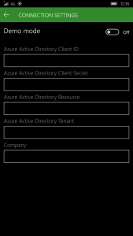

---
# required metadata

title: Install and configure Microsoft Dynamics 365 for Operations &#8211; Warehousing
description: This topic describes how to install and configure Microsoft Dynamics 365 for Operations - Warehousing.
author: YuyuScheller
manager: AnnBe
ms date: 2017-04-04
ms.topic: article
ms.prod: 
ms.service: Dynamics365Operations
ms.technology: 

# optional metadata

ms.search.form: SysAADClientTable, WHSMobileAppField, WHSMobileAppFieldPriority, WHSRFMenu, WHSRFMenuItem, WHSWorker
# ROBOTS: 
audience: Application User, IT Pro
# ms.devlang: 
# ms.reviewer: 121
ms.search.scope: Operations, Core
# ms.tgt_pltfrm: 
ms.custom: 267694
ms.assetid: d95d43b2-13ff-4189-a71a-3a1fb57d55ed
ms.search.region: global
ms.search.industry: Manufacturing
ms.author: mafoge
ms.search.validFrom: 2016-11-30
ms.dyn365.ops.version: Version 1611

---

# Install and configure Microsoft Dynamics 365 for Operations &#8211; Warehousing

This topic describes how to install and configure Microsoft Dynamics 365 for Operations - Warehousing.

Dynamics 365 for Operations - Warehousing is an application available on Google Play Store and Windows Store. For the current version of Microsoft Dynamics 365 for Operations, this app is provided as a standalone component, which means self-deployment on devices used for warehouse tasks. In order to use the app in your Dynamics 365 for Operations environment, you must download the app on each device and configure it to connect to your Dynamics 365 for Operations environment. This topic describes how to install the app on your devices. It also explains how to configure the app to connect to your Dynamics 365 for Operations environment.

## Prerequisites
The app is available on Android and Windows operating systems. To use this app, you must have one of the following supported operating systems installed on your devices. You must also have one of the following supported versions of Dynamics 365 for Operations. Use the information in the following table to evaluate if your hardware and software environment is ready to support the installation.

| Platform                    | Version                                                                                                                                                                     |
|-----------------------------|-----------------------------------------------------------------------------------------------------------------------------------------------------------------------------|
| Android                     | 4.4, 5.0, 6.0                                                                                                                                                               |
| Windows (UWP)               | Windows 10 (all versions)                                                                                                                                                   |
| Dynamics 365 for Operations | Microsoft Dynamics 365 for Operations version 1611 -or- Microsoft Dynamics Dynamics AX version 7.0/7.0.1 and Microsoft Dynamics AX platform update 2 with hotfix KB 3210014 |

## Get the app
-   Windows (UWP) - [Dynamics 365 for Operations - Warehousing on the Windows Store](https://www.microsoft.com/store/apps/9p1bffd5tstm)
-   Android - [Dynamics 365 for Operations - Warehousing on the Google Play Store](https://play.google.com/store/apps/details?id=com.Microsoft.Dynamics365forOperationsWarehousing)

## Create a web service application in Active Directory
To enable the app to interact with a specific Dynamics 365 for Operations server, you must register a web service application in a Azure Active Directory for the Dynamics 365 for Operations tenant. For security reasons, we recommend that you create a web service application for each device that you use. To create a web service application in Azure Active Directory (Azure AD), complete the following steps:

1.  In a web browser, go to <https://manage.windowsazure.com>.
2.  Enter the name and password for the user who has access to the Azure subscription.
3.  In Azure Portal, in the left navigation pane, click **Active Directory**.
4.  In the grid, select the Active Directory instance that is used by Dynamics 365 for Operations.
5.  On the top toolbar, click **Applications**. 
6.  In the bottom pane, click **Add**. The **Add application** wizard starts.
7.  Enter a name for the application and select **Web application and/or web API**. 
8.  Enter the sign-on URL, which is the application URL in your tenant, the root Operations URL. The sign-on URL is currently not being actively used in authenticating the app, but is a mandatory field. Enter the same URL in the App ID URI field. 
9.  Go to the **Configure** tab. 
10. Scroll down until you see the **Permissions to other applications** section. Click **Add application**. 
11. Select **Microsoft Dynamics ERP** in the list. Click the **Complete check** button in the right corner of the page. 
12. In the **Delegate Permissions** list, select all the check boxes. Click **Save**. 
13. Make a note of the following information:
    -   **Client ID** - As you scroll up the page, you will see **Client ID** displayed.
    -   **Key** - In the **Keys** section, create a key by selecting duration, and copy the key. This key will later be referred to as the **Client secret**.

## Create and configure a user account in Dynamics 365 for Operations
To enable Dynamics 365 for Operations to use your Azure AD application, you need to complete the following configuration steps:

1.  Create a new user account in Azure Active Directory for the Dynamics 365 for Operations tenant. The purpose of this user account is to access the specific custom service of the warehousing app, which the Dynamics 365 for Operations server exposes. After completing this step, you will have WMDP user credentials, which consist of a WMDP email address and a WMDP password. To learn about the basic steps for adding users to Azure AD and Dynamics 365 for Operations, refer to this tutorial: [Sign up for a Microsoft Dynamics 365 for Operations subscription](/dynamics365/operations/dev-itpro/sign-up-preview-subscription).
2.  Create a Dynamics 365 for Operations user that corresponds to the warehousing app user credentials.
    1.  In Dynamics 365 for Operations, go to **System administration** &gt; **Common** &gt; **Users**.
    2.  Create a new user.
    3.  Assign the Warehouse mobile device user, as shown in the following screenshot. 

3.  Associate your Azure Active Directory application with the warehousing app user.
    1.  In Dynamics 365 for Operations, go to **System administration** &gt; **Setup** &gt; **Azure Active Directory applications**.
    2.  Create a new line.
    3.  Enter the **Client ID** (obtained in the last section), give it a name, and select the previously created user. We recommend that you tag all your devices so that you can easily remove their access to Dynamics 365 for Operations from this page in case they are lost. 

## Configure the application
You must configure the app on the device to connect to the Dynamics 365 for Operations server through the Azure AD application. To do this, complete the following steps.

1.  In the app, go to **Connection settings**.
2.  Clear the **Demo mode** field. 
3.  Enter the following information: - **Azure Active directory client ID** - The client ID is obtained in step 13 in "Create a web service application in Active Directory". - **Azure Active directory client secret** - The client secret is obtained in step 13 in "Create a web service application in Active Directory". - **Azure Active directory resource** - The Azure AD directory resource depicts the Dynamics 365 for Operations root URL. **Note**: Do not end this field with a forward slash character (/). - **Azure Active directory tenant** - The Azure AD directory tenant used with the Dynamics 365 for Operations server: https://login.windows.net/&lt;your-AD-tenant-ID&gt;. For example: https://login.windows.net/contosooperations.onmicrosoft.com. **Note**: Do not end this field with a forward slash character (/). - **Company** - Enter the legal entity in Dynamics 365 for Operations to which you want the application to connect. 
4.  Select the **Back** button in the top-left corner of the application. The application will now connect to your Dynamics 365 for Operations server and the log-in screen for the warehouse worker will display. 

## Remove access for a device
In case of a lost or compromised device, you must remove access to Dynamics 365 for Operations for the device. The following steps describe the recommended process to remove access.

1.  In Dynamics 365 for Operations, go to **System administration** &gt; **Setup** &gt; **Azure Active Directory applications**.
2.  Delete the line that corresponds to the device to which you want to remove access. Note down the **Client ID** used for the removed device.
3.  Sign in the Azure classic portal at <https://manage.windowsazure.com>.
4.  Click the **Active Directory** icon on the left menu, and then click the desired directory.
5.  On the top menu, click **Applications**, and then click the application you want to configure. The **Quick Start** page will appear with single sign-on and other configuration information.
6.  Click the **Configure** tab, scroll down and ensure that the **Client ID** of the application is the same as in step 2 in this section.
7.  Click the **Delete** button in the command bar.
8.  Click **Yes** in the confirmation message.

