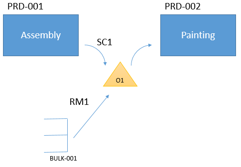

---
# required metadata

title: Warehouse work policies
description: A new warehouse work policy is introduced in Microsoft Dynamics AX 7.0.1 (May 2016 update). This work policy controls whether warehouse work is created for warehouse processes in manufacturing.
author: YuyuScheller
manager: AnnBe
ms.date: 04/04/2017
ms.topic: article
ms.prod: 
ms.service: Dynamics365Operations
ms.technology: 

# optional metadata

ms.search.form: WHSWorkPolicy
# ROBOTS: 
audience: Application User
# ms.devlang: 
# ms.reviewer: 2094
ms.search.scope: AX 7.0.0, Operations, Core
# ms.tgt_pltfrm: 
ms.custom: 196561
ms.assetid: cbf48ec6-1836-48d5-ad66-a9b534af1786
ms.search.region: Global
ms.search.industry: Manufacturing
ms.author: johanho
ms.search.validFrom: 2016-05-31
ms.dyn365.ops.version: AX 7.0.1

---

# Warehouse work policies

[!include[banner](../includes/banner.md)]

A new warehouse work policy is introduced in Microsoft Dynamics AX 7.0.1 (May 2016 update). This work policy controls whether warehouse work is created for warehouse processes in manufacturing.

This work policy controls whether warehouse work is created for warehouse processes in manufacturing. You can set up the work policy by using a combination of **work order types**, an **inventory location**, and a **product**. For example, product L0101 is reported as finished to output location 001. The finished good is later consumed in another production order at output location 001. In this case, you can set up a work policy to prevent the work for finished goods put-away from being created when you report product L0101 as finished to output location 001. The work policy is an individual entity that can be described through the following information:

-   **Work policy name** (the unique identifier of the work policy)
-   **Work order types** and **Work creation method**
-   **Inventory locations**
-   **Products**

## Work order types
You can select the following work order types:

-   Finished goods put away
-   Co-product and by-product put away
-   Raw material picking

The **Work creation method** field has the value **Never**. This value indicates that the work policy will prevent warehouse work from being created for the selected work order type.

## Inventory locations
You can select a location that the work policy applies to. If no location is associated with a work policy, the work policy doesn’t apply to any processes. On the **Locations** page, you can also select or cancel the selection of the work policy for a specific location.

## Products
You can select a product that the work policy applies to. You can apply the work policy to either all products or selected products.

## Example
In the following example, there are two production orders, PRD-001 and PRD-00*2*. Production order PRD-001 has an operation that is named **Assembly**, where product SC1 is being reported as finished to location O1. Production order PRD-002 has an operation that is named **Painting** and consumes product SC1 from location O1. Production order PRD-002 also consumes raw material RM1 from location O1. RM1 is stored in warehouse location BULK-001 and will be picked to location O1 by warehouse work for raw material picking. The picking work is generated when production PRD-002 is released. 

 

When you plan to configure a warehouse work policy for this scenario, you should consider the following information:

-   Warehouse work for finished goods put-away isn’t required when you report product SC1 as finished from production order PRD-001 to location O1. This is because the **Painting** operation for production order PRD-002 consumes SC1 at the same location.
-   Warehouse work for raw material picking is required in order to move raw material RM1 from warehouse location BULK-001 to location O1.

Here is an example of the work policy that you can set up, based on these considerations.

|                                         |                                                       |
|-----------------------------------------|-------------------------------------------------------|
|**Work policy name**                  |**Work order types**                                |
| No put away 01     `                    |- Finished good put away                            |
|                                         |**Locations**                                       |
|                                         |- O1   |                                               |
|                                         |**Products**                                        |
|                                         |- SC1                                                  |

The following procedures provide step-by-step instructions about how to set up the warehouse work policy for this scenario. A sample setup showing how to report a production order as finished to a location that isn’t license plate–controlled is also described.

## Set up a warehouse work policy
Warehouse processes don’t always include warehouse work. By defining a work policy, you can prevent the creation of work for raw material picking and put-away of finished goods for a set of products at specific locations. The USMF demo data company was used to create this procedure. 

STEPS (21)

|     |                                                                            |
|-----|----------------------------------------------------------------------------|
| 1.  | Go to Warehouse management &gt; Setup &gt; Work &gt; Work policies.        |
| 2.  | Click New.                                                                 |
| 3.  | In the Work policy name field, type 'No put-away work'.                    |
| 4.  | Click Save.                                                                |
| 5.  | Click Add.                                                                 |
| 6.  | In the list, mark the selected row.                                        |
| 7.  | In the Work order type field, select 'Finished goods put away'.            |
| 8.  | Click Add.                                                                 |
| 9.  | In the list, mark the selected row.                                        |
| 10. | In the Work order type field, select 'Co-product and by-product put away'. |
| 11. | Expand the Inventory locations section.                                    |
| 12. | Click Add.                                                                 |
| 13. | In the list, mark the selected row.                                        |
| 14. | In the Warehouse list, enter '51'.                                         |
| 15. | In the Location field, enter or select '001'.                              |
| 16. | Expand the Products section.                                               |
| 17. | In the Product selection field, select 'Selected'.                         |
| 18. | Click Add.                                                                 |
| 19. | In the list, mark the selected row.                                        |
| 20. | In the Item number field, enter or select 'L0101'.                         |
| 21. | Click Save.                                                                |

## Report a production order as finished to a location that isn’t license plate–controlled
This procedure shows an example of reporting as finished to a location that isn't license plate–controlled. An applicable work policy is the prerequisite for this task. The previous procedure shows the setup of the work policy. 

STEPS (25)

<table>
<tbody>
<tr>
<td colspan="3"><strong>Sub-task: Set up an output location.</strong></td>
</tr>
<tr>
<td></td>
<td>1.</td>
<td>Go to Organization administration &gt; Resources &gt; Resource groups.</td>
</tr>
<tr>
<td></td>
<td>2.</td>
<td>In the list, select resource group '5102'.</td>
</tr>
<tr>
<td></td>
<td>3.</td>
<td>Click Edit.</td>
</tr>
<tr>
<td></td>
<td>4.</td>
<td>In the Output warehouse field, enter '51'.</td>
</tr>
<tr>
<td></td>
<td>5.</td>
<td>In the Output location field, enter '001'.</td>
</tr>
<tr>
<td></td>
<td>6.</td>
<td>Location 001 isn't a license plate–controlled location. You can set up a non–license plate output location only if an applicable work policy exists for the location.</td>
</tr>
<tr>
<td colspan="3"><strong>Sub-task: Create a production order and report it as finished.</strong></td>
</tr>
<tr>
<td></td>
<td>1.</td>
<td>Close the page.</td>
</tr>
<tr>
<td></td>
<td>2.</td>
<td>Go to Production control &gt; Production orders &gt; All production orders.</td>
</tr>
<tr>
<td></td>
<td>3.</td>
<td>Click New production order.</td>
</tr>
<tr>
<td></td>
<td>4.</td>
<td>In the Item number field, enter 'L0101'.</td>
</tr>
<tr>
<td></td>
<td>5.</td>
<td>Click Create.</td>
</tr>
<tr>
<td></td>
<td>6.</td>
<td>On the Action Pane, click Production order.</td>
</tr>
<tr>
<td></td>
<td>7.</td>
<td>Click Estimate.</td>
</tr>
<tr>
<td></td>
<td>8.</td>
<td>Click OK.</td>
</tr>
<tr>
<td></td>
<td>9.</td>
<td>Click Start.</td>
</tr>
<tr>
<td></td>
<td>10.</td>
<td>Click the General tab.</td>
</tr>
<tr>
<td></td>
<td>11.</td>
<td>In the Automatic BOM consumption field, select 'Never'.</td>
</tr>
<tr>
<td></td>
<td>12.</td>
<td>Click OK.</td>
</tr>
<tr>
<td></td>
<td>13.</td>
<td>Click Report as finished.</td>
</tr>
<tr>
<td></td>
<td>14.</td>
<td>Click the General tab.</td>
</tr>
<tr>
<td></td>
<td>15.</td>
<td>Select Yes in the Accept error field.</td>
</tr>
<tr>
<td></td>
<td>16.</td>
<td>Click OK.</td>
</tr>
<tr>
<td></td>
<td>17.</td>
<td>On the Action Pane, click Warehouse.</td>
</tr>
<tr>
<td></td>
<td>18.</td>
<td>Click Work details.</td>
</tr>
<tr>
<td></td>
<td>19.</td>
<td>When the production order was reported as finished, no work was generated for put-away. This occurs because a work policy is defined that prevents work from being generated when product L0101 is reported as finished to location 001.</td>
</tr>
</tbody>
</table>

